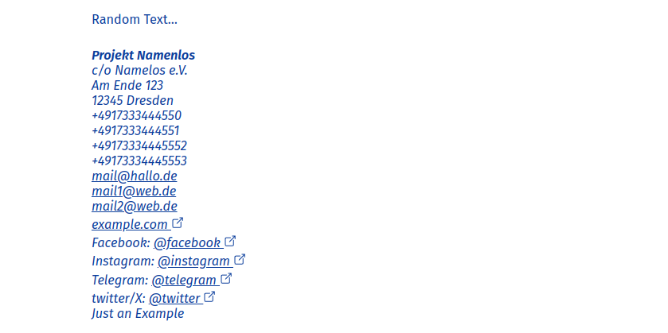

[](https://github.com/bringbackourneighbours/bringbackourneighbours/actions/workflows/verify.yml)
[](https://bringbackourneighbours.github.io/bringbackourneighbours/)


# Bring Back Our Neighbours

<!-- TOC -->

- [Bring Back Our Neighbours](#bring-back-our-neighbours)
  - [About](#about)
  - [Getting Started](#getting-started)
  - [Linters and Formatters](#linters-and-formatters)
  - [Requirements](#requirements)
  - [Contributing](#contributing)
    - [Code of conduct](#code-of-conduct)
    - [Project Structure](#project-structure)
    - [Adding Content](#adding-content)
      - [Block](#block)
      - [Standalone Content: Flyers, Kits and Pages](#standalone-content-flyers-kits-and-pages)
      - [Addresses](#addresses)
      - [Links](#links)
      - [Forms/Templates](#formstemplates)
      - [UI-Translation](#ui-translation)
    - [Translation](#translation)
    - [Creation of printable PDFs](#creation-of-printable-pdfs)

<!-- TOC -->

## About

We are developing comprehensive and multilingual information material on protection against deportations.
Visit https://bringbackourneighbours.de for the latest edition, Digital and to print out and for you to distribute.

## Getting Started

All commands are run from the root of the project, from a terminal:

| Command                   | Action                                           |
| :------------------------ | :----------------------------------------------- |
| `npm ci`                  | Installs dependencies.                           |
| `npm run dev`             | Starts local dev server at `localhost:4321`      |
| `npm run build`           | Build your production site to `./dist/`          |
| `npm run preview`         | Preview your build locally, before deploying     |
| `npm run astro ...`       | Run CLI commands like `astro add`, `astro check` |
| `npm run astro -- --help` | Get help using the Astro CLI                     |

## Linters and Formatters

| Command                                                                     | Action                                                          |
| :-------------------------------------------------------------------------- | :-------------------------------------------------------------- |
| `npx stylelint --fix src/*.css **/*.astro`                                  | Automatically fix CSS and Astro file styling issues             |
| `npx prettier --write "**/*.astro" "**/*.ts" "**/*.css" "**/*.md"`          | Format Astro, TypeScript, CSS, and Markdown files               |
| `npx eslint . --ignore-pattern ".astro/**" --ignore-pattern "src/env.d.ts"` | Run ESLint on all files, ignoring .astro files and src/env.d.ts |

## Requirements

For now, we have tested this project mainly on ubuntu 24.04., as this is the worker GitHub will provide us, but it
should work on all kinds of machines.

This projects needs to have the following software installed:

- [node.js](https://nodejs.org/en/download) LTS with npm
- all [dependencies](https://pptr.dev/guides/system-requirements) of puppeteer with chromium.

## Contributing

As part of the ‘Bring Back Our Neighbours’ campaign, we, a group of full-time and volunteer activists in the field of
asylum and political education in Saxony, Germany, have produced several information flyers and this emergency kit
against deportations.

The aim is to provide people who fear deportation, voluntary supporters and professionals with a quick overview and
further information on the subject of deportations.

The information is primarily for Saxony. Much of it is valid and helpful throughout Germany. However, the contacts to
advice centres and authorities are only for Saxony. Please contact us if you are considering adding more information on
other regions.

We try to ensure that all information is up-to-date and complete. However, we would be happy to receive further
information and criticism from you. What has worked in the past to prevent deportation? Write to
info@bringbackourneighbours.de or directly
[open an issue](https://github.com/bringbackourneighbours/bringbackourneighbours/issues/new/choose)
here in github.

### Code of conduct

TBA

We fundamentally reject deportations as inhumane; they symbolise racism and nationalism.

We criticise the violent practice of deportations in Saxony, which endangers people’s lives and health.

We want to protect as many people as possible from this violence.

### Project Structure

See: https://github.com/bringbackourneighbours/docs/tree/main/architecture for more details and the initial ideas.

```text
/
├── public/
├── src/
│   ├── assets/
│   ├── components/
│   │    ├── design/
│   │    ├── markdown/
│   │    └── *.astro
│   ├── content/
│   ├── integrations/
│   ├── layouts/
│   ├── model/
│   ├── pages/
│   ├── testing/
│   └── util/
└── package.json
```

Astro looks for `.astro`, `.md` or `.mdx` files in the `src/pages/` directory.
Each page is exposed as a route based on its file name.
See [Astro-docs on Pages](https://docs.astro.build/en/basics/astro-pages/) about it.

All other `.astro`-files in `src/components/` and `src/layouts` are just normal components.
Layouts components are being used to define the basic html base.

Whereas the components in `src/components/markdown` are used to be renders within `.mdx` files. Within
`src/components/markdown/MarkdownEntry.astro` you will find some logic to replace the with fake versions for translation
purpose.
The components in `src/components/design` should provide the visual building blocks of the whole app, those components
should not be depended on the `content`.
You can add them easily on https://bringbackourneighbours.de/showcase/ or http://localhost:4321/showcase and check and
test them out

`content` contains the actual content of the app – see below for more details.

In `src/integrations` there are some custom Astro-Integration we use to generate the page and the pdfs.

`models` contains basic interfaces and types as all over the app.

`utils` contains functions and helpers.

`testing` contains helpers for unit testing.

Any static assets, like images, can be placed in the `public/` directory – they will end up directly in the root of the
generated `dist`.

### Adding Content

All the content is stored in the directory `src/content` with the following structure:

```text
/
├── public/             # => Files that we provide for direct download
├── src/
│   └── content/
│       ├── addresses/  # => all the Addresses
│       ├── blocks/     # => all the Blocks
│       ├── flyers/     # => all the Flyers
│       ├── kits/       # => all the Kits
│       ├── pages/      # => all the Pages
│       ├── ui/         # => all the text we use on the website, like "share"
│       └── config.ts   # => all the main file hold the configuration of all the content-structure
└── package.json
```

#### Block

The biggest portion of the content is stored as so called `blocks`. Those blocks will be embedded in the other
"standalone" content types.

All block need to be in the [MDX](https://mdxjs.com) format, it has the file ending `.mdx` or `.md` (if only using the
base markdown features).

Place the files in `/src/content/blocks`. Add a folder per block, that contains one mdx file per language. The file and
folder names are not evaluated.

Each block has a "frontmatter"-section and content body below. Within the body you can embed other elements, even
different
blocks. Please note, that you don't need to and should not import other component in the MDX body, as it would impact
the mapping logic.

Example Block: `/src/content/blocks/example/de.mdx`:

```yaml
---
identifier: example       # identifier to embed the block
lang: de                  # language of tme block
lastChecked: 2025-07-08   # the day this content was last checked. use to spot outdated translations
fallback: en              # (optional) another language, it will be shown as fallback. use if no translation is available but content is necessary
machineTranslation: false # (optional) mark that the content was not translated by a human and may contain errors.
---

# h1

Random Text in the markdown format

  # h2

* list item1
* list item2
* list item3

<Block
identifier="another"
lang="tr"
/>

```

#### Standalone Content: Flyers, Kits and Pages

To actually show the content we need to put in one of the standalone content collections. They all behave in the same
way and are super-sets of the normal 'blocks', but additionally you need to provide a `title` and a `seo`-text.

Example Block: `/src/content/flyers/example/de.mdx`:

```yaml
---
identifier: example # identifier to embed the block
lang: de # language of tme block
lastChecked: 2025-07-30 # the day this content was last checked. use to spot outdated translations
title: How to stop a deportation # will also be used as
seo: Around 150 Characters # will be set a meta description for search engines
fallback: en # (optional) another language, it will be shown as fallback. use if no vvtranslation available but content is necessary
machineTranslation: false # (optional) mark that the content was not translated by a human and may contain errors.
---
Random Text in the **markdown** format
```

#### Addresses

All the Adresses of a consultation center, a group or just a website.

An Adresses needs to be in the [YAML](https://en.wikipedia.org/wiki/YAML) format, it has the file ending `.yaml` or
`.yml`.

Example:

```yaml
# every Address needs at least
identifier: my-address # the identifier you have to use to reference this address
lastChecked: 2024-07-17 # date this address was last checked for correctness
name: Projekt Namenlos # the main title of the address, the name of the group/organisation

# all other information is optional
additional: c/o Namelos e.V. #  addition information, like subtitel or addtion address information
streetLine: Am Ende 123
zip: '12345'
city: Dresden

# mail ahd phone can be plural or singular, or even both
mail: mail@hallo.de
mails:
  - mail1@web.de
  - mail2@web.de

phone: '+4917333444550'
phones:
  - '+4917333444551'
  - '+49173334445552'
  - '+49173334445553'

url: example.com # the url is the website

# for social media only use the username, not the full url
facebook: facebook
instagram: instagram
telegram: telegram
twitter: twitter

# you can add a note on the address. providing some context, explaining what this organisation is doing. only the one in the current language will be shown
translatedNotes:
  de: 'Nur ein Beispiel'
  en: 'Just an Example'
```

To use an Address in the Content(MDX-only) you first have to import the component and then place it with the identifier
set.
In most Component the `Address` is imported automatically.

Usage-Example:

```yaml
---
identifier: some-content
lang: de
lastChecked: 2025-12-27
---
// Import the component if needed, in most content it will work without
import Address from '../../../components/Address.astro';

Random Text...

<Address identifier="my-address"/>
```

This together will result in something like


#### Links

Within the content we link to material (pdf, audio, video, webpages) from others, sometimes differently for each
language.

For each link you have to create a file in the [YAML](https://en.wikipedia.org/wiki/YAML) format, it has the file ending
`.yaml` or `.yml`.

Within the file there can be a section for each language, that the material is available. Additional optionally a
section `all` can be used, all properties with in this section will be overridden by the properties per language.

Example Link: `/src/content/links/example.yml`:

```yaml
all:
  type: PDF
en:
  slug: stuff
  url: www.anothersite.com/thathassomeinteresstingstuffEnglish.pdf
  title: Interessting Stuff
de:
  slug: zeugs
  url: www.anothersite.com/thathassomeinteresstingstuffGerman.pdf
  title: Interessesantes Zeugs
```

#### Forms/Templates

We have compiled templates that can be used in an emergency, i.e. in the event of an ongoing deportation. Those might be
forms as Pdfs or Docs that can be directly downloaded form our site.

To make them available the files can be uploaded in the folder `public/forms`. Then create a (external) Link, that
points to the document. Best use a relative URI.

Example File: `/public/forms/Urgent Application.pdf`

Example Link: `/src/content/links/form_urgent.yml`:

```yaml
en:
  slug: urgent
  url: /forms/Urgent Application.pdf
  type: DOC
  title: Urgent application to the administrative court for the granting of tolerated stay, prevention of the deportation scheduled for today
```

Usage-Example:

```yaml
---
identifier: some-content
lang: de
lastChecked: 2024-01-31
---
Random Text

<ExternalShortLink identifier="form_urgent"/>
```

#### UI-Translation

Apart from the content of the interface of the website and the printable pdfs also contains text, which needs to be
translated. Like "descargar en PDF" or "download as PDF". All those strings are stored in one `JSON` file per language
in then folder `src/content/ui`.

### Translation

If you want to add another language, you just have to add more of content files in the new language. As soon as the
files are placed they can be viewed, still the language will remain "hidden".

To publish the language: Within the files `src/model/languages.ts` is a definition of the currently active Languages:
the `SupportedLanguages`, add the new language there.

The live website provides a handy tool to export all text in a easy so edit way in 2 languages for translations.
Visit: https://bringbackourneighbours.de/internal-translate/de-en/

There you can copy the whole content into your clipboard and the paste it with in office software, like LibreOffice.

### Creation of printable PDFs

To generate uptodate pdf versions of the content, we use `puppeteer` within the ci-pipeline. This is hooked up as
astro-intergration but works also locally in dev mode.

In general puppeteer will open up a (headless) browers and visit one page per flyer and kit, when the page is fully
puppeteer will use the browsers buildin "print" function and export the page as pdf.

We can use CSS and also a [Astro.local](https://docs.astro.build/en/reference/api-reference/#locals) `isPrint` to
programmtically change the design and behavior of the compontents so the same content can be used for web and print.

To inspect the pages before printing visit for example: http://localhost:4321/internal-print/flyer-de-police

After all the pdfs have been created, we open the pdfs in separate intergrations and check for the number of pages to
avoid losing content and also concat the pdf together so its more convient to print them all at once.
